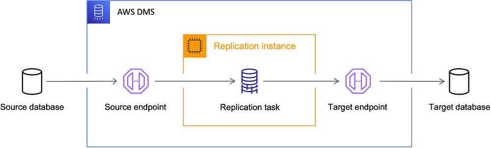

# DMS (Data migration Service)

It is a cloud service which is used for migrating Relational Databases,data warehouses, NoSQL databases, and other types of data stores.

### How it do:
DMS is a server in the AWS Cloud that runs replication software. 
We create a source and target connection to tell AWS DMS where to extract the data and where to store the data.
Next, we run a schedule task that run on the DMS server, which will move the data.
DMS creates tables, associate primary key (if not on target), we can create own target table schema.

### [Ref](https://docs.aws.amazon.com/dms/latest/userguide/Welcome.html)

## High level View

To perform a database migration, AWS DMS connects to the source data store, reads the source data, and formats the data for consumption by the target data store. It then loads the data into the target data store. Most of this processing happens in memory, though large transactions might require some buffering to disk. Cached transactions and log files are also written to disk.

### What DMS does:
1. Discover the suitable database for migration.
2. Automatically converts the source database schema and database code object to some suitable format target database.
3. Create a replication Server.
4. Create a source and a target endpoints that have informations about data stores.
5. Create one or more migration taks to migrate data from the source to target data stores.

### Tasks phases
- Migration of existing data (Full load).
- The application of cached changes.
- Ongoing replication (Change Data Capture)

### During a full load migration with AWS DMS:

**Data Loading:** AWS DMS moves data from the source to the target database.

**Change Capture:** Changes made during loading are cached and then applied once the full load for each table completes.

**Ongoing Replication:** After all cached changes are applied, AWS DMS switches to real-time replication.Initially, there may be a lag due to a backlog of transactions.

**Completion:** Once the backlog is cleared and the source and target are in sync, you can switch your applications to use the target database.

AWS DMS can create essential schema objects needed for migration or use DMS Schema Conversion to convert and migrate more complex database objects.

## Components
### Overview
AWS DMS (Database Migration Service) enables the migration of databases using several key components. Understanding these components helps optimize data migration and troubleshooting.

----

### Key Components
1. Database discovery
2. Schema and code migration
3. Replication instance
4. Endpoint
5. Replication tasks

### 1. Database discovery
**DMS Fleet Advisor:** Collects data from multiple database environments without needing installation on every computer.

**Supported Databases:** Microsoft SQL Server, MySQL, Oracle, PostgreSQL.

**Inventory:** Helps in reviewing and monitoring database servers and objects.

### 2. Schema and Code Migration

**DMS Schema Conversion:** Converts schemas and code objects between different database types.

**Components:**

**Instance Profiles:** Network and security settings.

**Data Providers:** Store database connection credentials.

**Migration Projects:** Contain data providers, instance profiles, and migration rules.

### 3. Replication Instance

**Managed EC2 Instance:** Hosts one or more replication tasks.

**Storage:** Comes with either 50 GB or 100 GB of storage; can be increased if needed.

**High Availability:** Supports Multi-AZ deployment for automatic failover.

### 4. Endpoint

**Types:** Source or Target.

**Configuration:** Requires server name, port, encryption settings, and credentials.

**Connection Test:** Must be successful before use in tasks.

**Customization:** Endpoint settings can control various behaviors such as logging and file size.

### 5. Replication Tasks

***Types:***

**Full Load:** Migrates existing data.

**Full Load + CDC:** Migrates data and replicates ongoing changes.

**CDC Only:** Only replicates ongoing changes.

***Task Settings:***

**Instance:** Which replication instance will host the task.

**Endpoints:** Source and target.

**Migration Type:** Full Load, Full Load + CDC, CDC Only.

**Target Table Preparation:** Do nothing, drop tables, truncate.

**LOB Modes:** Exclude, Full, Limited.

**Table Mappings and Transformations:** Specify which tables to migrate and how to transform data.

**Data Validation:** Ensures data integrity.

**Logging:** Uses Amazon CloudWatch for task logs.

These components and settings ensure a smooth and efficient database migration process using AWS DMS. For more detailed information, refer to AWS DMS documentation.

