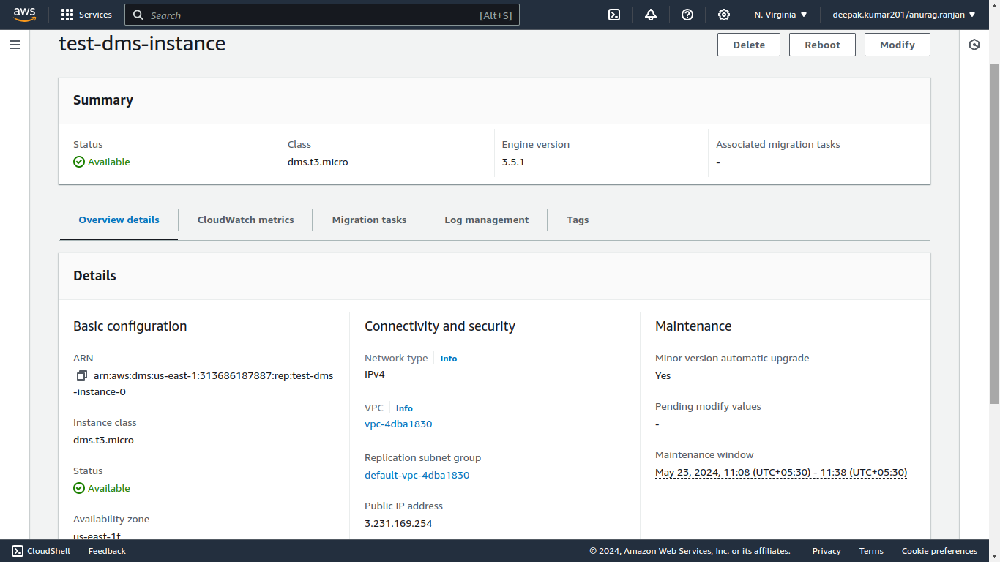
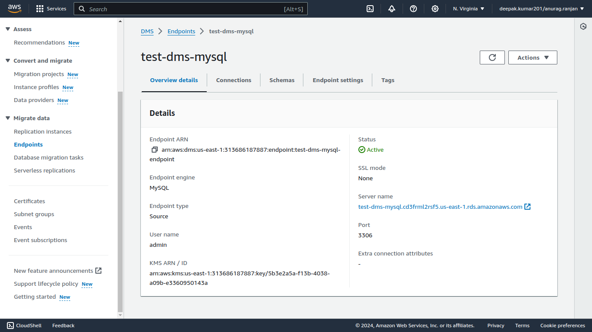
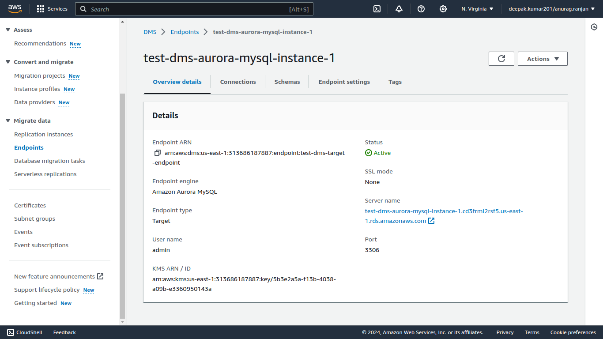
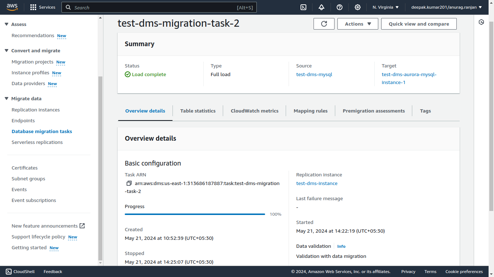
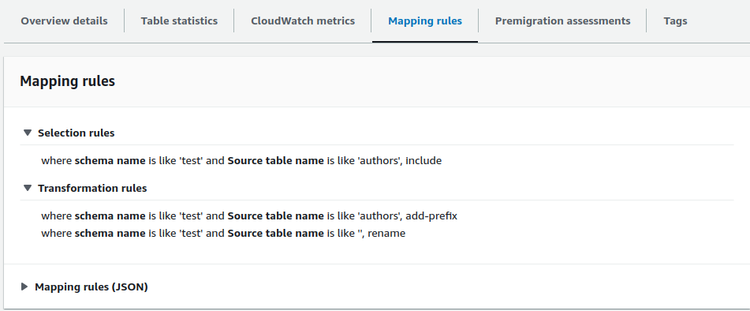

# Migration using AWS Data Migration Service (DMS)

Here we will demonstrate how to migrate databases from MySQL to Aurora MySQL using AWS Data Migration Service (DMS).

## Steps
1. **Schema Copy:** First, copy the schema to the target database to ensure consistency.
2. **Replication Instance:** Create a replication instance that will handle all the processing tasks.
3. **Source Endpoint:** Configure the source database location.
4. **Target Endpoint:** Configure the target database location.
5. **Migration Task:** Set up a task to schedule and manage the migration process.

## Schema Copy

Since we only want to replicate the schema from the source database to the target database, this process is straightforward and brief.

#### First, create a `mysqldump` of only the schema of the source database and tables:

```sh
mysqldump -h test-dms-mysql.cd3frml2rsf5.us-east-1.rds.amazonaws.com -u admin -p --databases test --single-transaction --set-gtid-purged=OFF --no-data > schema.sql
```

#### Then load the schema to the target database:

```sh
mysql -h test-dms-aurora-mysql-instance-1.cd3frml2rsf5.us-east-1.rds.amazonaws.com -u admin -p < schema.sql 
```

Now we have the required schema in the target database. Only the data part remains.

## Creating Replication Instance

- **Name:** The unique name of the replication instance.
- **ARN:** The ARN for the replication instance.
- **Instance Class:** The type of instance (e.g., `dms.t3.medium`, `dms.t3.large`).
- **Engine Version:** The AWS DMS version to run on your replication instance.
- **High Availability:** Multi-AZ or Single-AZ.
- **Storage:** The amount of storage space for your replication instance. AWS DMS uses this storage for log files and cached transactions while replication tasks are in progress.
- **VPC:** The VPC ID.
- **Replication Subnet Group:** A subnet group for your replication instance. This defines the IP ranges and subnets that your instance can use within the VPC.
- **Publicly Accessible:** Boolean (True if a public IP address is needed).
- **Availability Zone:** Choose an availability zone (AZ) for the replication instance. The default is "No preference," meaning AWS DMS will determine the AZ.
- **VPC Security Groups:** Choose one or more security groups for your replication instances. These groups specify inbound and outbound rules to control network access.
- **AWS KMS Key:** For encrypted data sharing.
- **Maintenance Window:** Choose a time window for automatic version upgrades.



## Endpoints

### Endpoint Type
- Source or Target endpoint
- True, If RDS is in same Region
    - Choose RDS Instance

### Endpoint Configuration

- **Endpoint Identifier:** A label for the endpoint to help you identify it (e.g., dev-source-mysql-endpoint).
- **Endpoint Type:** Specify whether this is a source or target endpoint.
- **Engine Name:** The type of database engine (e.g., mysql, aurora).
- **Server Name:** The DNS name or IP address of the database server.
- **Port:** The port used to access the database.
- **Username:** The username to access the database.
- **Password:** The password to access the database.
- **Database Name:** The name of the database to connect to.
- **SSL Mode:** The SSL mode to use when connecting to the database (e.g., require, verify-full).
- **Extra Connection Attributes:** Any additional attributes required for the connection.

## Creating Source Endpoint



## Creating Target Endpoint



## Creating Migration Task

### Task configuration
- **Task identifier:** Unique Identifier for the task.
- **Replication Instance:** A replication instance. (previously create replication instance)
- **Source database endpoint:** A source database endpoint. (previously create source endpoint)
- **Target database endpoint:** A target database endpoint. (previously create target endpoint)
- **Migration type:**
    - Migrate existing data (Full load Only)
    - Migrate existing data and replicate ongoing changes(Full load and CDC)
    -  Replicate data changes only(CDC only) 

### Task settings
- **Target table preparation mode:** What should happen on the target database.
    - Do nothing 
    - Drop tables on target
    - Truncate
- **Data Validation:** Turn on if want to use validation on the migrated data.

#### Overview



#### Mapping Rules



Here we define the mapping rules:

1. **Selection Rules:**
   - Only include the table `authors` from schema `test`.

2. **Transformation Rules:**
   - Add a prefix `aurora_` to the table name.
   - Rename the schema from `test` to `aurora_test`.

```json
{
    "rules": [
        {
            "rule-type": "transformation",
            "rule-id": "268891179",
            "rule-name": "268891179",
            "rule-target": "table",
            "object-locator": {
                "schema-name": "test",
                "table-name": "authors"
            },
            "parallel-load": null,
            "rule-action": "add-prefix",
            "value": "aurora",
            "old-value": null
        },
        {
            "rule-type": "transformation",
            "rule-id": "268835593",
            "rule-name": "268835593",
            "rule-target": "schema",
            "object-locator": {
                "schema-name": "test"
            },
            "parallel-load": null,
            "rule-action": "rename",
            "value": "aurora_test",
            "old-value": null
        },
        {
            "rule-type": "selection",
            "rule-id": "268804369",
            "rule-name": "268804369",
            "object-locator": {
                "schema-name": "test",
                "table-name": "authors"
            },
            "rule-action": "include",
            "filters": []
        }
    ]
}
```
---
## Finally after creating all ther resource we can start the migration task by making a action of Resume/Restart in Data Migration Task.