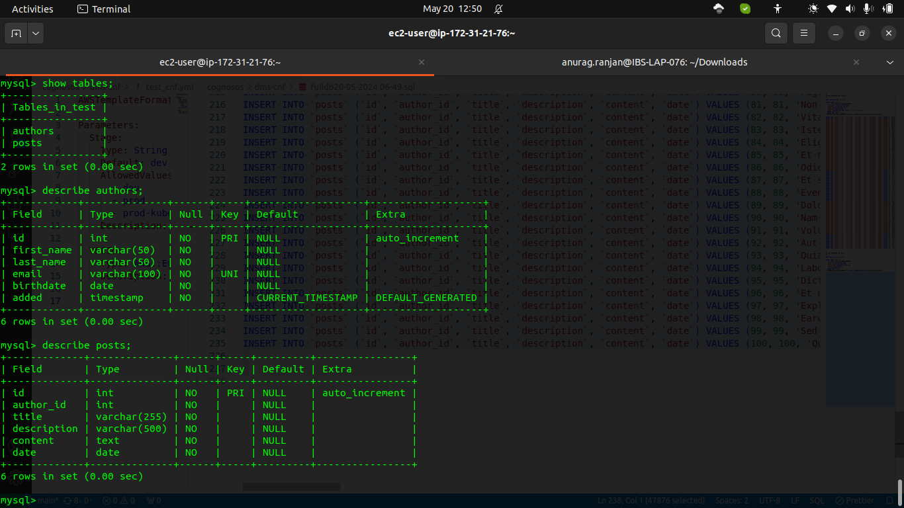
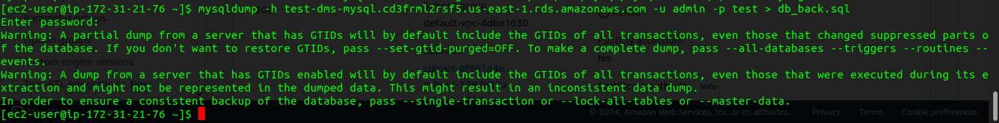
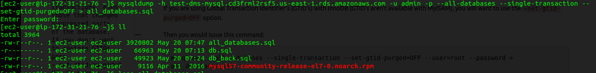
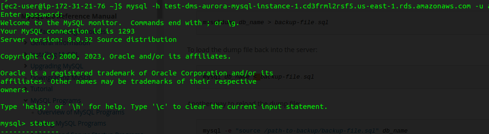
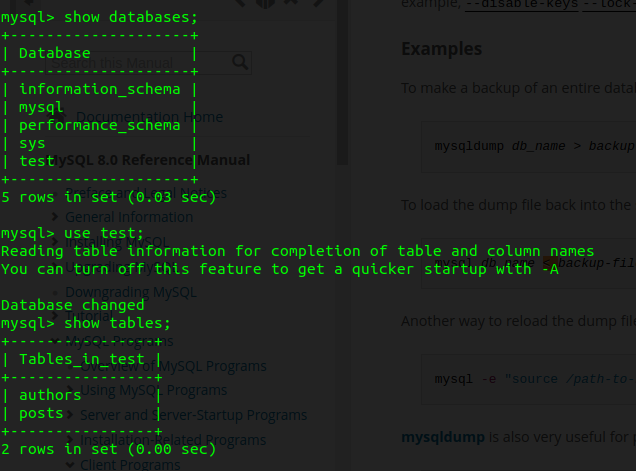
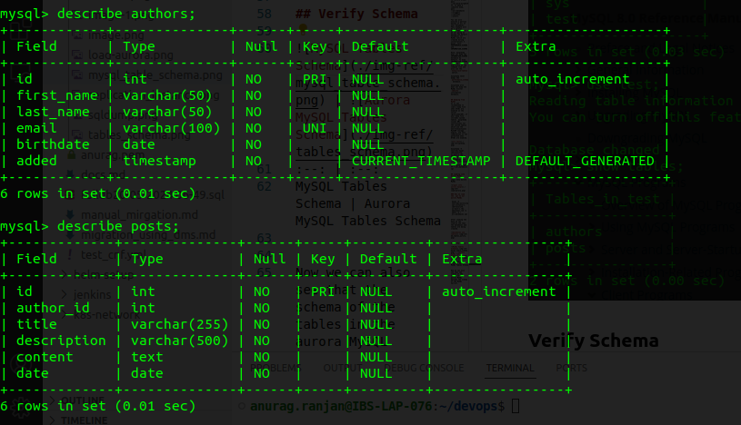
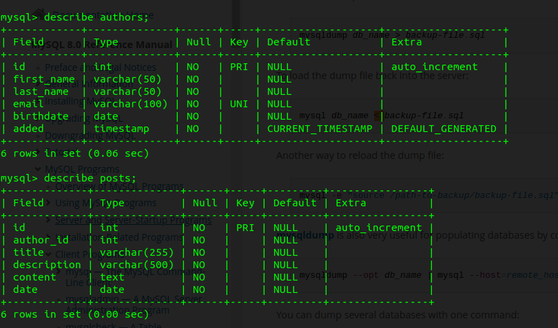

# Manual Migration

Here we are going to migrate from MySQL to Aurora MySQL manually

## MySQL 

Here we can see the schema of both the tables.

## Dumping the database



While duing mysqldumb for our test database.

If you are using Global Transaction Identifier’s (GTID’s) with InnoDB (GTID’s aren’t available with MyISAM), you will want to use the `–set-gtid-purged=OFF` option.

Then you would issue this command:
```
mysqldump --all-databases --single-transaction --set-gtid-purged=OFF --user=root --password > all_databases.sql
```
Otherwise you will see this error:
```
Warning: A partial dump from a server that has GTIDs will by default include the GTIDs of all transactions, even those that changed suppressed parts of the database. If you don't want to restore GTIDs, pass --set-gtid-purged=OFF. To make a complete dump, pass --all-databases --triggers --routines --events.
```
You can also execute a partial backup of all of your databases. This example will be a partial backup because I am not going to backup the default databases for MySQL (which are created during installation) — mysql, test, PERFORMANCE_SCHEMA and INFORMATION_SCHEMA

Note: mysqldump does not dump the INFORMATION_SCHEMA database by default. To dump INFORMATION_SCHEMA, name it explicitly on the command line and also use the `–skip-lock-tables` option.

mysqldump never dumps the `performance_schema` database.

mysqldump also does not dump the MySQL Cluster `ndbinfo` information database.


## Dumping from MySQl
It is not recommended to load a dump file when GTIDs are enabled on the server (gtid_mode=ON), if your dump file includes system tables. mysqldump issues DML instructions for the system tables which use the non-transactional MyISAM storage engine, and this combination is not permitted when GTIDs are enabled.


```
mysqldump -h test-dms-mysql.cd3frml2rsf5.us-east-1.rds.amazonaws.com -u admin -p --databases test --single-transaction --set-gtid-purged=OFF > all_databases.sql
```

## Loading into Aurora MySQL

Login Into Aurora MySQL



### Now we load the .sql to our aurora MySQL 
```
 mysql -h test-dms-aurora-mysql-instance-1.cd3frml2rsf5.us-east-1.rds.amazonaws.com -u admin -p < all_databases.sql 
```

After loading the data we can clearly see that the databases and tables are being created.




## Verify Schema

 | 
:--: | :--:
MySQL Tables Schema | Aurora MySQL Tables Schema


Now we can also see that the schema of the tables in the aurora MySQL matches the schema of the MySQL earlier.

## Problems

During Manual migration several potential issue may arise:

1. Data Consistency: Ensuring data consistency is very important, there should not be any data loss during migration.

2. Migration Downtime: Based on the size the of the database the downtime can be higher.

3. Data Transfer Limitation: Since the manual migration works by dumping the data, so in case of larger database the time and memory can go up. So use suitable solutions.