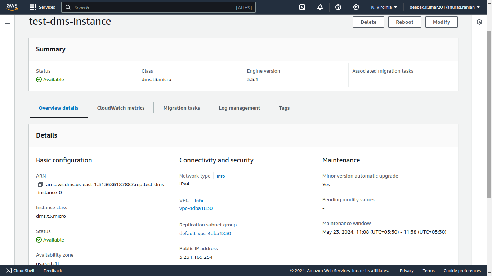
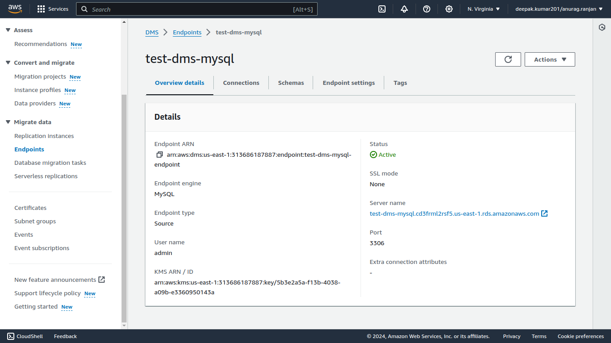
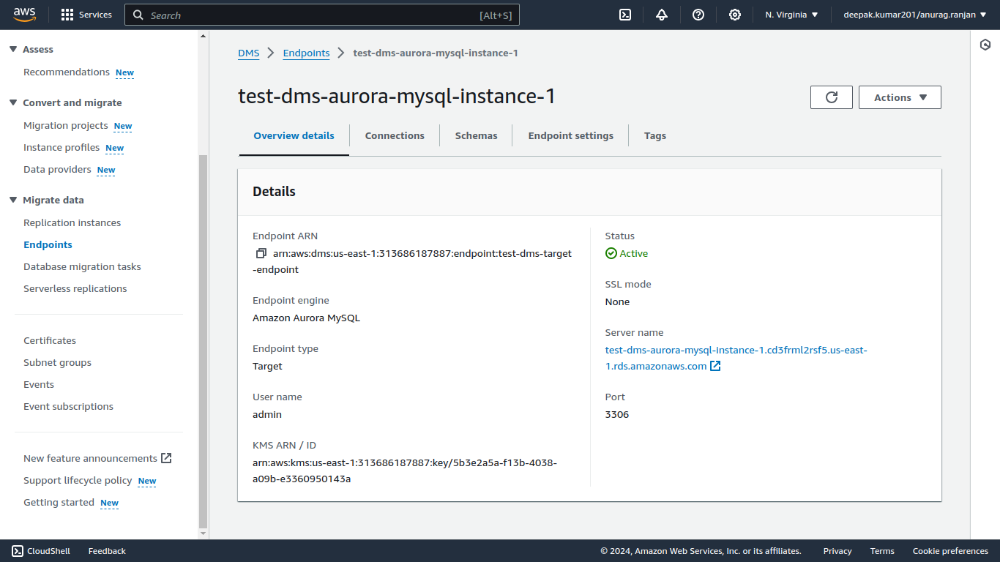
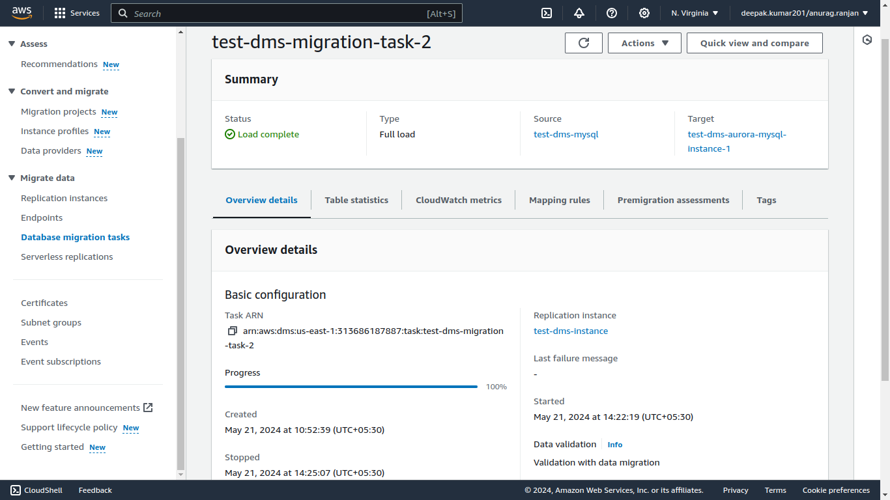
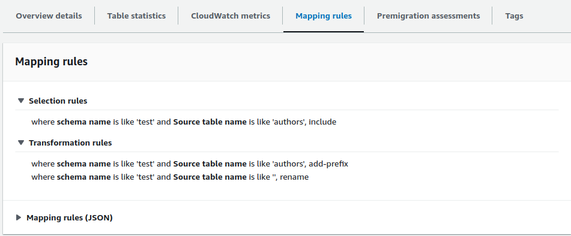

# Migration using DMS

Now we are going to do the migration using DMS (Data Migration Service).

## Steps
1. **Schema Copy:**  First we should copy the schema to the target database to make the schema consistent.

2. **Replication Instance:** For data we are going to ceate a replication Instance which will be responsible for all the processing tasks.

3. **Source Endpoint:** Used for locating the source database.

4. **Target Endpoint:** It is used for setting the target database.

5. **Migration Task:** This task is responsible for acting as a task scheduler.

## Schema Copy 

Since we only want to replicate the schema from source database to target database it.
It is easy and short process.

#### First we create a mysqldump of only schema of the source database and tables:

```
 mysqldump -h test-dms-mysql.cd3frml2rsf5.us-east-1.rds.amazonaws.com -u admin -p --databases test --single-transaction --set-gtid-purged=OFF --no-data > schema.sql
```

#### Then we load the schema to the target database:

```
mysql -h test-dms-aurora-mysql-instance-1.cd3frml2rsf5.us-east-1.rds.amazonaws.com -u admin -p < schema.sql 
```

Now we got the required the schema to target database, Now the data part is only remaining.

## Creating replication Instance

- **Name** : The name of replication instance (unique)
- **ARN** : A ARN name for the replication instance
- **Instance Class** : the type of instance (dms.t3.medium,dms.t3.large, etc.)
- **Engine Version** : AWS DMS version to run on your replication instance.
- **High Avalibility** : Multi-AZ or Single-AZ
- **Storage** : The amount of storage space you want for your replication instance. AWS DMS uses this storage for log files and cached transactions while replication tasks are in progress.
- **VPC** : The VPC Id of the VPC.
- **Replication subnet group** :  a subnet group for your replication instance. The subnet group defines the IP ranges and subnets that your replication instance can use within the VPC you've chosen.
- **Public Accessible** : Boolen (True to have  Public IP address)

- **Availability zone** :
Choose an availability zone (AZ) where you want your replication instance to run. The default is “No preference”, meaning that AWS DMS will determine which AZ to use.

- **VPC security groups** : Choose one or more security groups for your replication instances. The security groups specify inbound and outbound rules to control network access to your instance.

- **AWS KMS key** : To have encrypted data sharing

- **Maintenance Window** : To choose time window for Automatic version upgrade.




## Creating Source Endpoint



## Creating Target Endpoint



## Creating Migration Task

### Test

#### Overview



#### Mapping Rules



Here we define the mapping rules like
1. Selection rules

It will only include the table name `authors` from schema `test` 

2. We are here transforming the Entire schema to use a prefix
 `test_2_` 
```
{
    "rules": [
        {
            "rule-type": "transformation",
            "rule-id": "268891179",
            "rule-name": "268891179",
            "rule-target": "table",
            "object-locator": {
                "schema-name": "test",
                "table-name": "authors"
            },
            "parallel-load": null,
            "rule-action": "add-prefix",
            "value": "aurora",
            "old-value": null
        },
        {
            "rule-type": "transformation",
            "rule-id": "268835593",
            "rule-name": "268835593",
            "rule-target": "schema",
            "object-locator": {
                "schema-name": "test"
            },
            "parallel-load": null,
            "rule-action": "rename",
            "value": "aurora_test",
            "old-value": null
        },
        {
            "rule-type": "selection",
            "rule-id": "268804369",
            "rule-name": "268804369",
            "object-locator": {
                "schema-name": "test",
                "table-name": "authors"
            },
            "rule-action": "include",
            "filters": []
        }
    ]
}
```